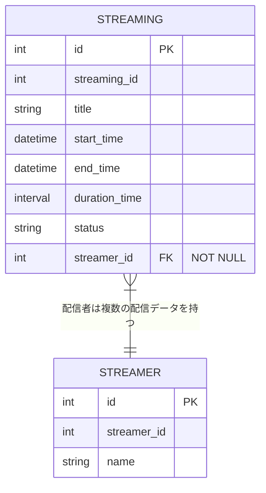

# ER図

```mermaid
erDiagram

    STREAMING }|--|| STREAMER : "配信者は複数の配信データを持つ"
    STREAMING {
        int id PK
        int streaming_id
        string title
        datetime start_time
        datetime end_time
        interval duration_time
        string status
        int streamer_id FK "NOT NULL"
    }

    STREAMER {
        int id PK
        int streamer_id
        string name
    }
```
