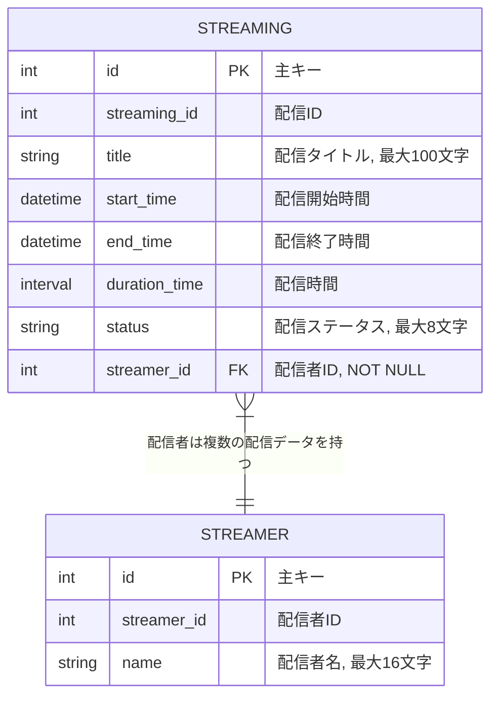

# ER図

```mermaid
erDiagram

    STREAMER {
        int id PK "主キー"
        int streamer_id "配信者ID"
        string name "配信者名, 最大16文字"
    }

    STREAMING }|--|| STREAMER : "配信者は複数の配信データを持つ"
    STREAMING {
        int id PK "主キー"
        int streaming_id "配信ID"
        string title "配信タイトル, 最大100文字"
        datetime start_time "配信開始時間"
        datetime end_time "配信終了時間"
        interval duration_time "配信時間"
        string status "配信ステータス, 最大8文字"
        int streamer_id FK "配信者ID, NOT NULL"
    }
```
