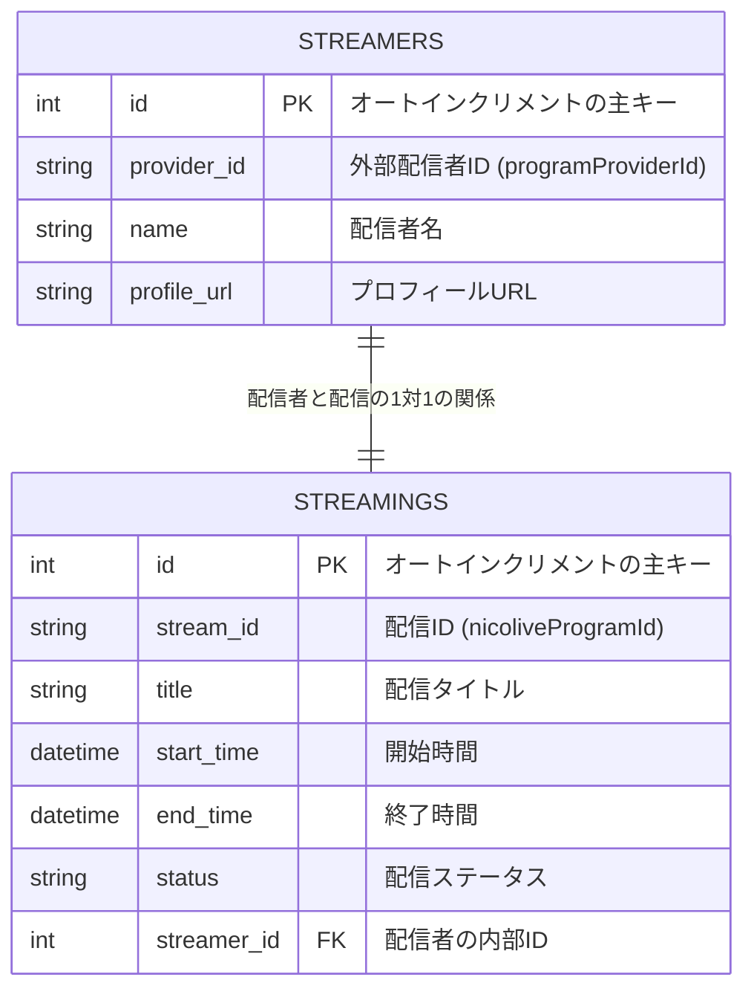

# ER図

```mermaid
erDiagram
    STREAMERS ||--|| STREAMINGS : "配信者と配信の1対1の関係"

    STREAMERS {
        int id PK "オートインクリメントの主キー"
        string provider_id "外部配信者ID (programProviderId)"
        string name "配信者名"
        string profile_url "プロフィールURL"
    }

    STREAMINGS {
        int id PK "オートインクリメントの主キー"
        string stream_id "配信ID (nicoliveProgramId)"
        string title "配信タイトル"
        datetime start_time "開始時間"
        datetime end_time "終了時間"
        string status "配信ステータス"
        int streamer_id FK "配信者の内部ID"
    }
```
