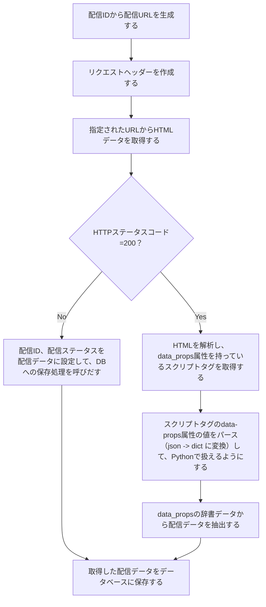

# flowchart

```mermaid


flowchart TD
    A[配信IDから配信URLを生成する] --> B[リクエストヘッダーを作成する]
    B --> C[指定されたURLからHTMLデータを取得する]
    C --> D{HTTPステータスコード=200？}
    D -- No --> E[配信ID、配信ステータスを配信データに設定して、DBへの保存処理を呼びだす]
    E ----> I
    D -- Yes --> F[HTMLを解析し、data_props属性を持っているスクリプトタグを取得する]
    F --> G[スクリプトタグのdata-props属性の値をパース（json -> dict に変換）して、Pythonで扱えるようにする]
    G --> H[data_propsの辞書データから配信データを抽出する]
    H --> I[取得した配信データをデータベースに保存する]


```
